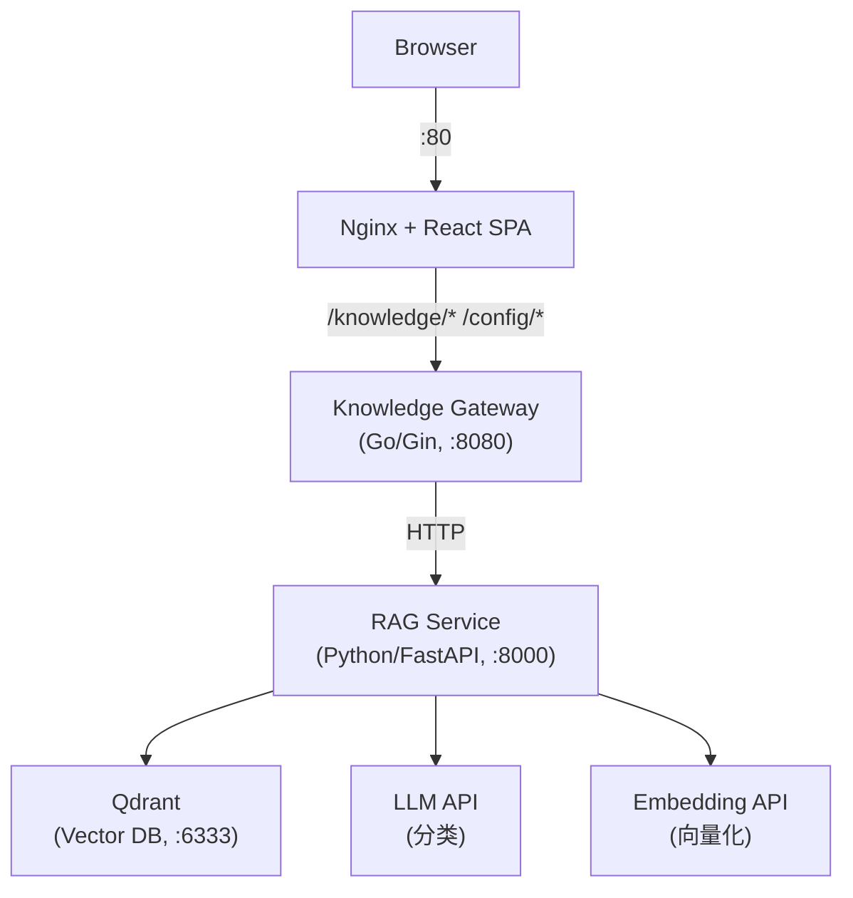
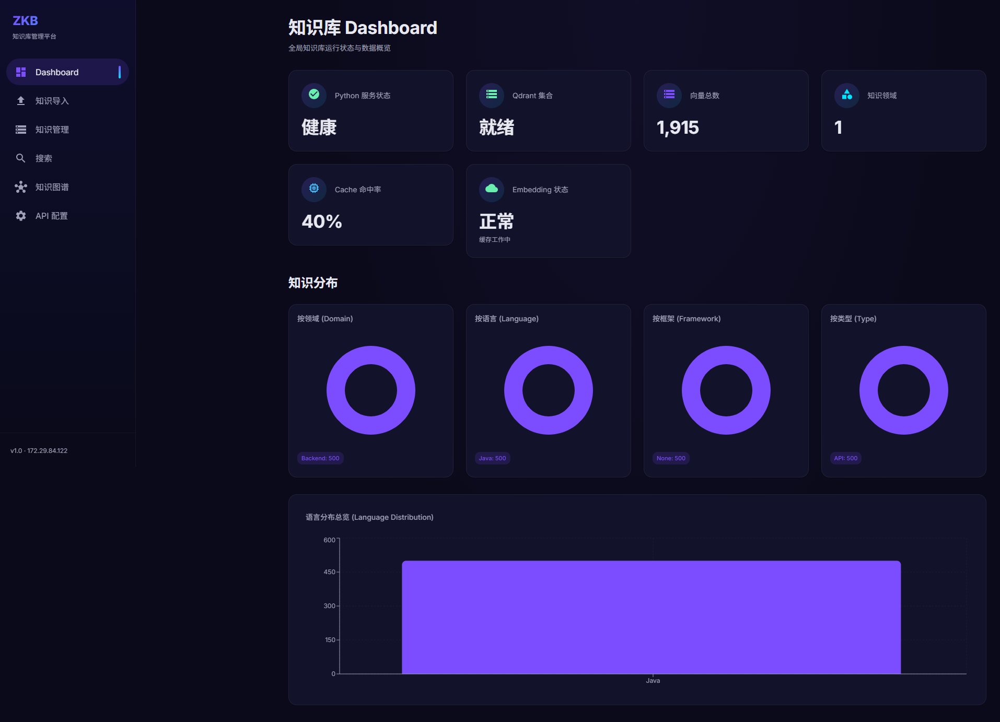
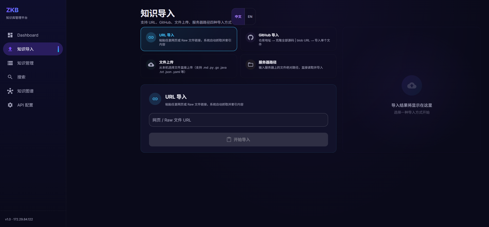
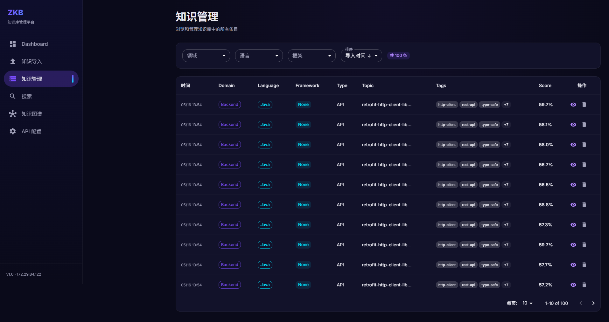
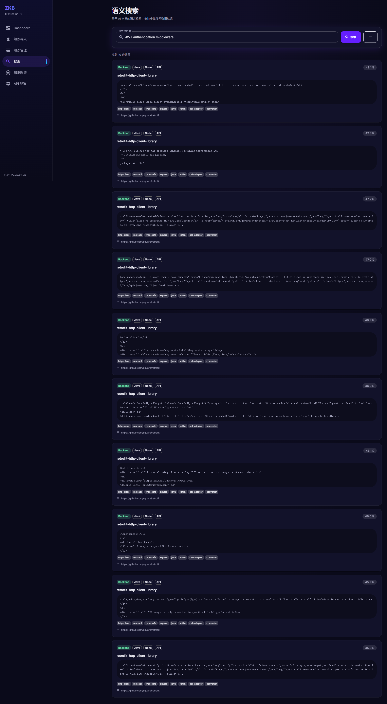
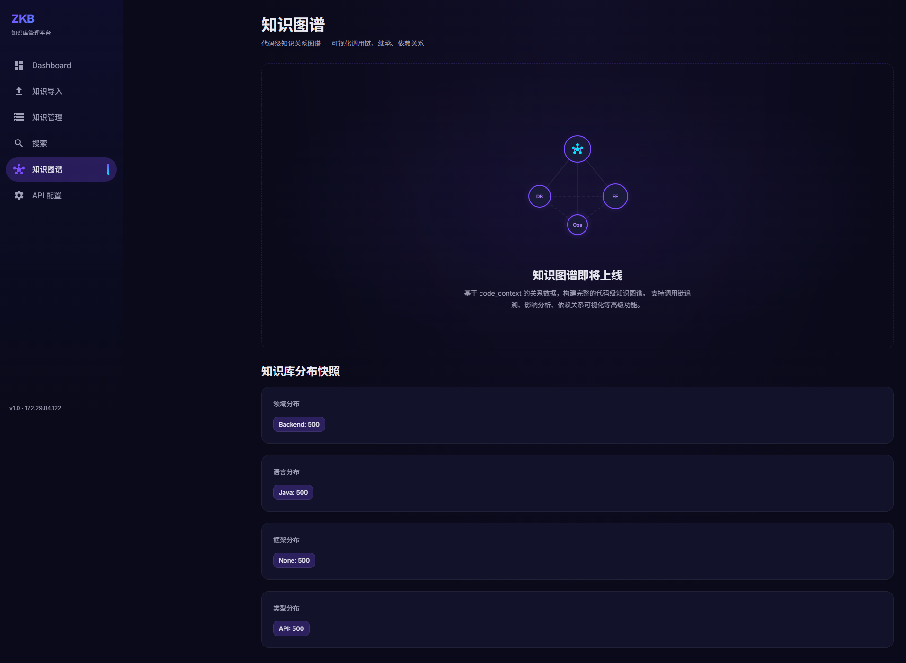
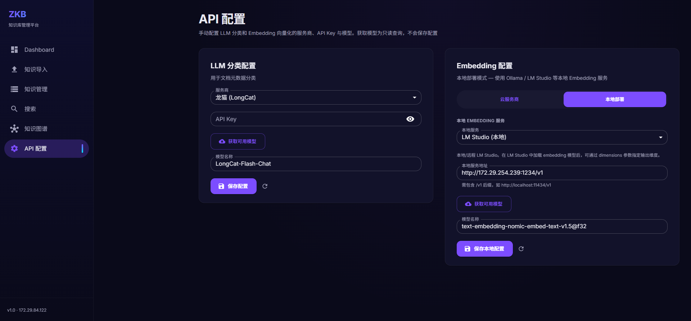

# ZKB — 多技术栈 AI 知识库系统

基于 **LLM 分类 + Embedding 向量化 + Qdrant 向量检索** 的智能知识管理平台。支持多项目代码仓库导入、语义搜索、元数据聚合分析，集成 **可配置 AI 服务商**（LLM / Embedding 运行时热切换，无需重启）。

---

## 架构



| 层 | 技术 | 端口 | 职责 |
|----|------|:---:|------|
| **UI** | React 19 + Vite + Nginx | 80 | 前端交互、SSE 流式进度 |
| **Gateway** | Go 1.26 + Gin | 8080 | 统一路由、代理转发 |
| **RAG Service** | Python 3.14 + FastAPI + LlamaIndex | 8000 | 核心管线：导入/分块/分类/向量化/检索 |
| **Qdrant** | Docker 官方镜像 | 6333 | 向量存储、相似度检索 |

---

## 截图

| Dashboard | 知识导入 | 知识管理 |
|:---:|:---:|:---:|
| [](./screenshots/dashboard.png) | [](./screenshots/import.png) | [](./screenshots/knowledge.png) |

| 语义搜索 | 知识图谱 | API 配置 |
|:---:|:---:|:---:|
| [](./screenshots/search.png) | [](./screenshots/graph.png) | [](./screenshots/settings.png) |

---

## 功能

### 知识导入
- 支持 **URL / GitHub 文件 / GitHub 仓库 / 本地文件** 四种来源
- GitHub 仓库一键导入（`gitingest` 智能过滤，自动忽略二进制和 vendor 目录）
- **SSE 流式管道** 实时展示进度：获取 → 分块 → 分类 → 向量化 → 存储
- **取消/回退**：中途取消自动通过 `batch_id` 物理删除已写入数据

### 语义搜索
- 自然语言查询 + **多维元数据过滤**（领域、语言、框架、类型、标签、项目）
- 返回结果含相似度评分、分类元数据、时间戳

### 知识图谱
- 元数据聚合统计（Domain / Language / Framework / Type 分布）
- 可视化图表（Recharts）

### AI 服务商可配置
- **6 个云服务商**：OpenAI / Gemini / DeepSeek / 智谱 / 龙猫 / Cloudflare
- **3 类本地部署**：Ollama / LM Studio / 自定义 OpenAI 兼容
- LLM 和 Embedding **运行时热切换**，无需重启
- **主备双 Provider** 自动容灾（主 429/5xx → 自动切备用）
- Embedding **LRU 缓存**（SHA-256 去重，max 2048 条目）
- 模型列表 **API 实时获取** + 预设回退

### Dashboard
- 服务健康状态、向量总数、领域覆盖、缓存命中率、Embedding 状态

---

## 技术栈

| 组件 | 技术 |
|------|------|
| 前端 | React 19, Vite 8, MUI 9, Recharts |
| 网关 | Go 1.26, Gin 1.10 |
| 知识处理 | Python 3.14, FastAPI, LlamaIndex, Pydantic |
| 向量数据库 | Qdrant (Docker) |
| LLM | OpenAI / Gemini / DeepSeek / 龙猫 / 智谱（OpenAI 兼容协议） |
| Embedding | Gemini / OpenAI / Cloudflare / 智谱 / Ollama / LM Studio |
| 部署 | Docker Compose / systemd / Shell |

---

## 快速开始

### 前置要求

- Docker + Docker Compose
- LLM API Key（如 [龙猫](https://longcat.chat) 免费额度）
- Embedding API Key（如 [Gemini](https://aistudio.google.com) 免费层）

### 一键部署

```bash
git clone https://github.com/643063150/ZKB.git
cd ZKB/deploy

# 1. 交互式配置端口
chmod +x deploy.sh
./deploy.sh config

# 2. 编辑 .env 填入 API Key
vim .env

# 3. Docker Compose 启动
./deploy.sh docker
```

浏览器打开 `http://<服务器IP>` 即见前端。

### 服务管理

```bash
./deploy.sh status          # 查看服务状态
./deploy.sh logs rag        # 查看 RAG 日志
./deploy.sh logs gateway    # 查看 Gateway 日志
./deploy.sh restart ui      # 重启前端
./deploy.sh stop            # 停止全部
```

### 导入第一批数据

```bash
# 导入 GitHub 仓库
curl -X POST http://localhost:8080/knowledge/import \
  -H "Content-Type: application/json" \
  -d '{"source":"https://github.com/gin-gonic/gin","source_type":"github_repo"}'

# 语义搜索
curl -X POST http://localhost:8080/knowledge/search \
  -H "Content-Type: application/json" \
  -d '{"query":"How to write middleware?","filters":{"language":"Go"},"top_k":5}'
```

---

## 项目结构

```
ZKB/
├── README.md                       ← 本文档
├── DEPLOY.md                       ← 部署教程
├── data-model.md                   ← 数据模型设计
├── screenshots/                    ← UI 截图
├── deploy/
│   ├── deploy.sh                   ← 一键部署脚本
│   ├── docker-compose.yml          ← Docker Compose
│   ├── Dockerfile.rag/gateway/ui   ← 容器镜像
│   ├── nginx.conf                  ← Nginx 配置
│   └── .env.example                ← 环境变量模板
├── knowledge-gateway/              ← Go API 网关
│   ├── main.go                     ← 路由注册
│   ├── handler/knowledge.go        ← 请求处理
│   ├── client/python.go            ← RAG 服务客户端
│   └── client/qdrant.go            ← Qdrant 客户端
├── rag-service/                    ← Python 知识处理
│   ├── main.py                     ← FastAPI 入口
│   ├── indexer.py                  ← 导入管道
│   ├── retriever.py                ← 语义检索
│   ├── classifier.py               ← LLM 分类器
│   ├── embedder.py                 ← 多 Provider Embedding
│   ├── providers.py                ← AI 服务商定义
│   ├── provider_config.py          ← 配置持久化
│   └── models.py                   ← Pydantic 模型
└── zkb-ui/                         ← React 前端
    ├── src/pages/
    │   ├── ImportPage.tsx           ← 知识导入
    │   ├── SearchPage.tsx           ← 语义搜索
    │   ├── KnowledgePage.tsx        ← 知识浏览
    │   ├── DashboardPage.tsx        ← Dashboard
    │   ├── GraphPage.tsx            ← 知识图谱
    │   └── SettingsPage.tsx         ← API 配置
    └── src/api/knowledge.ts         ← API 客户端
```

---

## 文档

| 文档 | 说明 |
|------|------|
| [DEPLOY.md](./DEPLOY.md) | 部署教程（Docker / 裸机 / 端口配置 / 日志查看） |
| [data-model.md](./data-model.md) | 数据模型设计（KnowledgeItem Schema + Code Knowledge Graph） |
| [rag-service/rag-service-api.md](./rag-service/rag-service-api.md) | RAG Service API 文档 |
| [knowledge-gateway/backend-api.md](./knowledge-gateway/backend-api.md) | Gateway API 文档 |

---

## License

MIT
